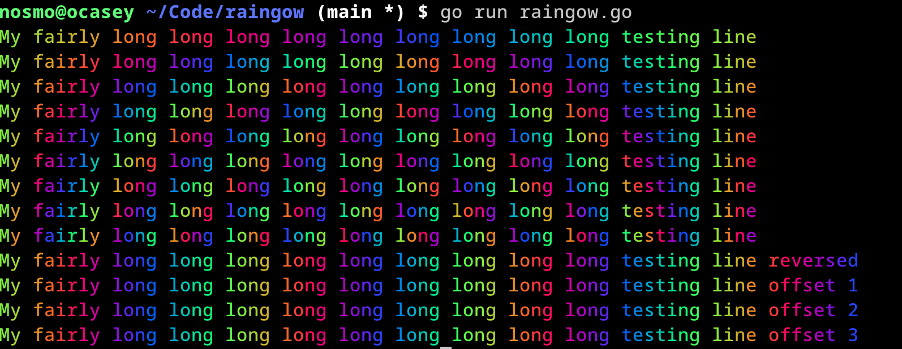

raingow
=====

Create rainbow text, heavily inspired by [lolcat](https://github.com/busyloop/lolcat).

## Library usage

```go
package main

import (
	"fmt"

	"github.com/nosmo/raingow"
)

func main() {
	for span := 1.0; span <= 9.0; span++ {
		fmt.Println(raingow.RaingowLine("My fairly long long long long long testing line", span))
	}
}
```

Produces output like:



## Logrus formatter

```go
import "github.com/nosmo/raingow/logrusfmt"

log := logrusfmt.NewLogger()
log.Info("My other fairly long long long long long testing line")
```

Or attach the formatter to an existing logger:

```go
logger.Formatter = logrusfmt.New()
```

## CLI

```sh
go build
cat /etc/passwd | ./bin/raingow --span 5
```
