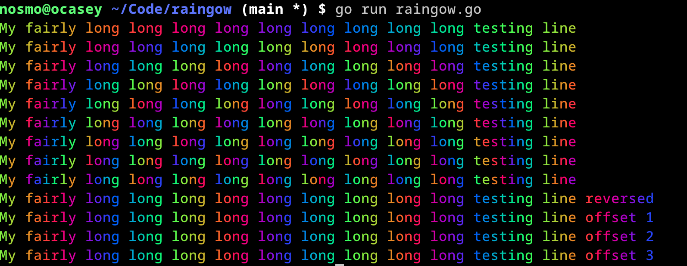

raingow
=====

Create rainbow text heavily inspired by [lolcat](https://github.com/busyloop/lolcat).

Example usage:
```golang
package main

import ("fmt"
	"github.com/nosmo/raingow"
)

func main() {

	fmt.Println(raingow.Raingow_line("My fairly long long long long long long long long long testing line", 1.0))
	fmt.Println(raingow.Raingow_line("My fairly long long long long long long long long long testing line", 2.0))
	fmt.Println(raingow.Raingow_line("My fairly long long long long long long long long long testing line", 3.0))
	fmt.Println(raingow.Raingow_line("My fairly long long long long long long long long long testing line", 4.0))
	fmt.Println(raingow.Raingow_line("My fairly long long long long long long long long long testing line", 5.0))
	fmt.Println(raingow.Raingow_line("My fairly long long long long long long long long long testing line", 6.0))
	fmt.Println(raingow.Raingow_line("My fairly long long long long long long long long long testing line", 7.0))
	fmt.Println(raingow.Raingow_line("My fairly long long long long long long long long long testing line", 8.0))
	fmt.Println(raingow.Raingow_line("My fairly long long long long long long long long long testing line", 9.0))
	fmt.Println(raingow.Raingow_line("My fairly long long long long long long long long long testing line reversed",  3.0))
	fmt.Println(raingow.Raingow_line("My fairly long long long long long long long long long testing line offset 1",  3.0))
	fmt.Println(raingow.Raingow_line("My fairly long long long long long long long long long testing line offset 2",  3.0))
	fmt.Println(raingow.Raingow_line("My fairly long long long long long long long long long testing line offset 3",  3.0))
}
```
This code will produce output like

